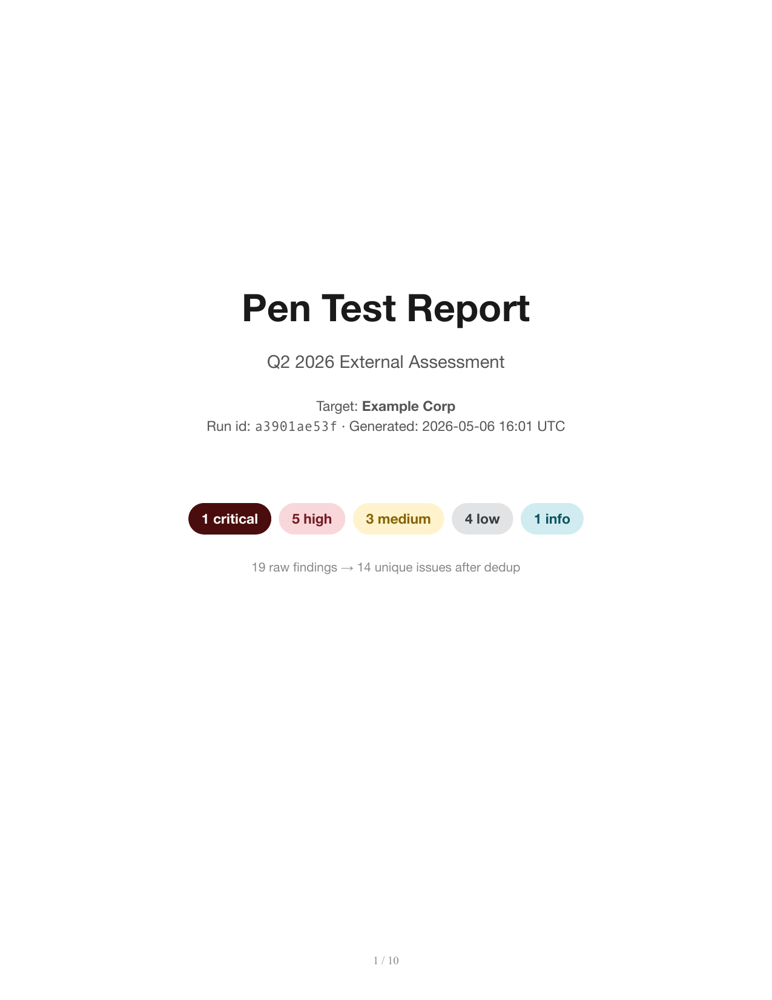
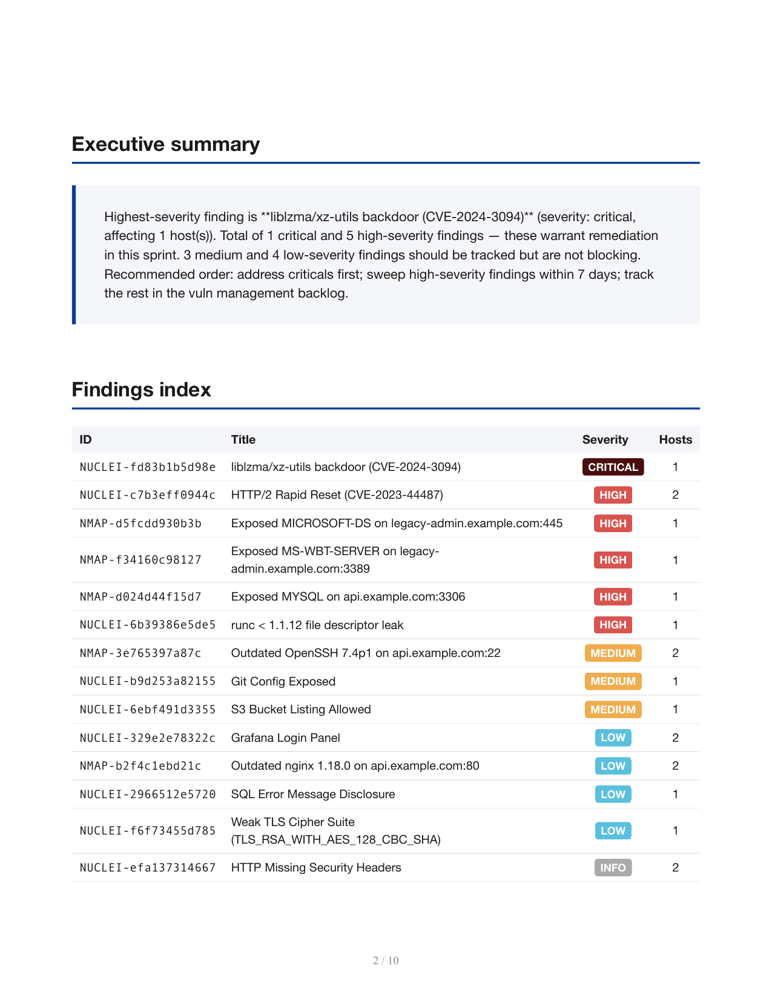
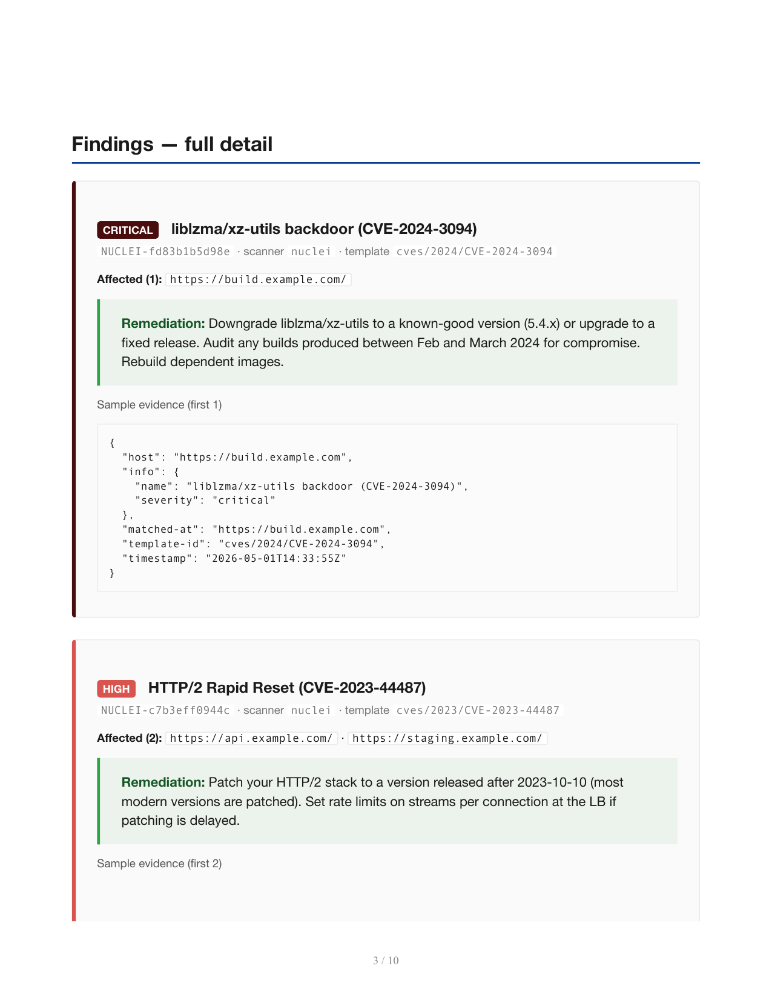

# pen-test-reporter

[](https://github.com/anthonyonazure/pen-test-reporter/actions/workflows/tests.yml)
[](https://www.python.org/)
[](LICENSE)

LangGraph agent that turns raw scanner output (nuclei, nmap, burp-style JSON) into a polished pen-test report PDF. **Deduplicates by template-id**, groups affected hosts inline, generates per-finding remediation guidance, severity-orders the index, and emits a SHA-256 sidecar for audit trail.

## What it solves

Pentesters spend half a Friday turning 800 lines of `nuclei` output and an `nmap` XML into a 30-page Word doc that says "yes, you have the same issue on 12 hosts." This collapses that to one command.

## Architecture

```
parse (multi-scanner) ──► dedup (group by template_id × severity) ──►
   narratives (exec summary + per-finding remediation, parallel) ──►
   pdf (cover, exec summary, index, full detail with evidence)
```

### Sample report

19 raw findings from `nuclei.jsonl` + `nmap.xml` get deduplicated into 14 unique issues across critical / high / medium / low / info. Each finding lists every affected host inline and gets its own remediation paragraph.

<p>
  
  
  
</p>

## Quick start

```bash
cd ../b2b-agent-toolkit && pip install -e ".[dev]" && cd -
pip install -e ".[dev]"

pentest run samples/nuclei.jsonl samples/nmap.xml \
    --engagement "Q2 2026 External Assessment" \
    --target "Example Corp"
```

Output:

```
reports/
├── <run-id>-pentest-report.pdf
└── <run-id>-pentest-report.sha256
out/
└── <run-id>.json   # machine-readable run trace
```

## Supported scanners

| Scanner | Input format | Severity heuristics |
|---|---|---|
| **nuclei** | JSONL (one finding per line) | passes through scanner severity |
| **nmap** | XML | exposed risky services (RDP/SMB/MySQL/MongoDB/Redis/etc.) get `high`; outdated products checked against minimum-safe versions |
| **burp-style JSON** | array of JSON | converted to JSONL internally |

Add a new scanner by writing one parser function that emits the normalized Finding shape. Same dedup + render pipeline applies.

## Layout

```
samples/
├── nuclei.jsonl                   # 12-finding demo input
└── nmap.xml                       # 7-port demo input
src/pentest/
├── parsers.py                     # nuclei + nmap → Finding[]
├── dedup.py                       # group by (template_id, severity); host count + samples
├── narrative.py                   # exec summary + per-finding remediation (LLM + stub)
├── state.py / graph.py / nodes.py # LangGraph: parse → dedup → narratives → pdf
└── cli.py                         # `pentest run <scanner-files...>`
templates/report.html              # WeasyPrint report template
```

## Why this is hard to fake

1. **Severity is the scanner's, not the LLM's.** We pass through nuclei's severity verbatim; nmap heuristics are deterministic Python with version comparisons. Auditors trust it.
2. **Every finding cites the source scanner + template id.** Reviewers can re-run the scanner and verify.
3. **PDF SHA-256 is written to a sidecar.** Auditors can verify the report wasn't edited after generation.
